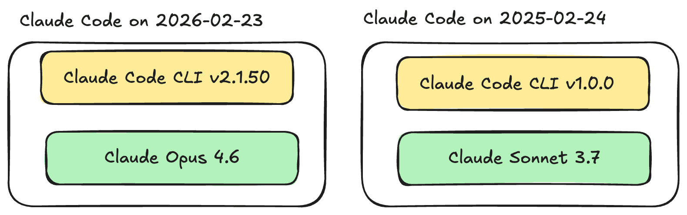
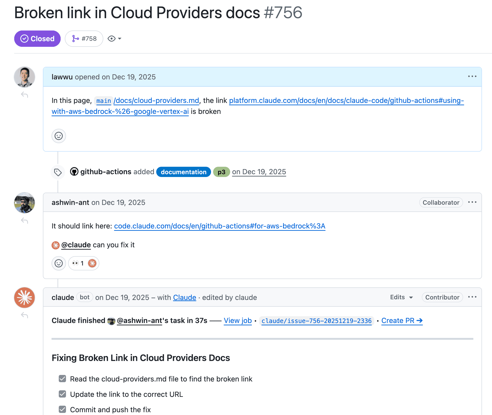
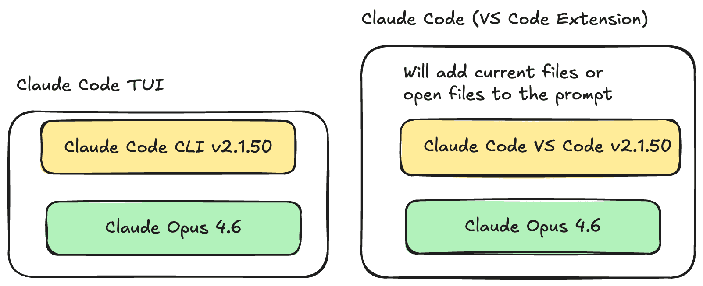
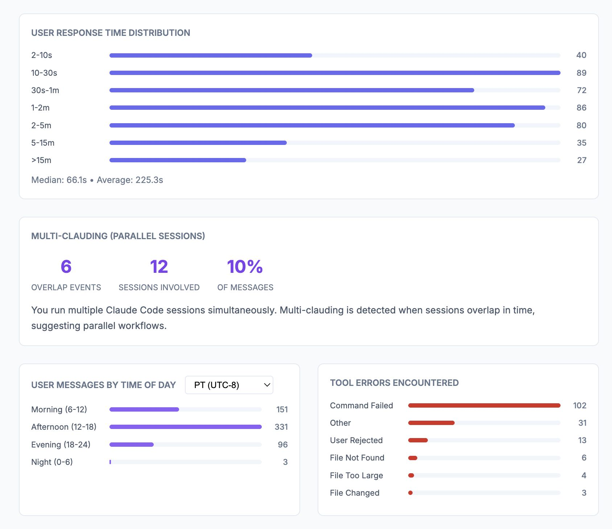
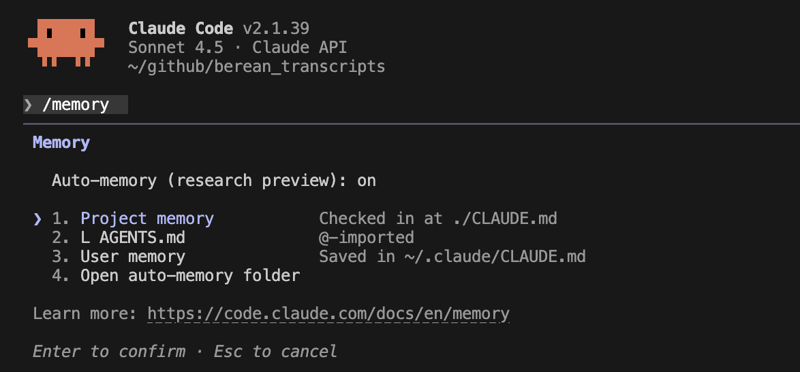
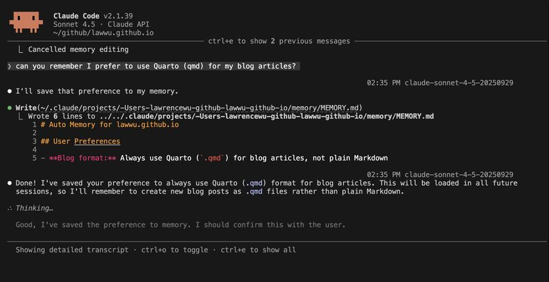
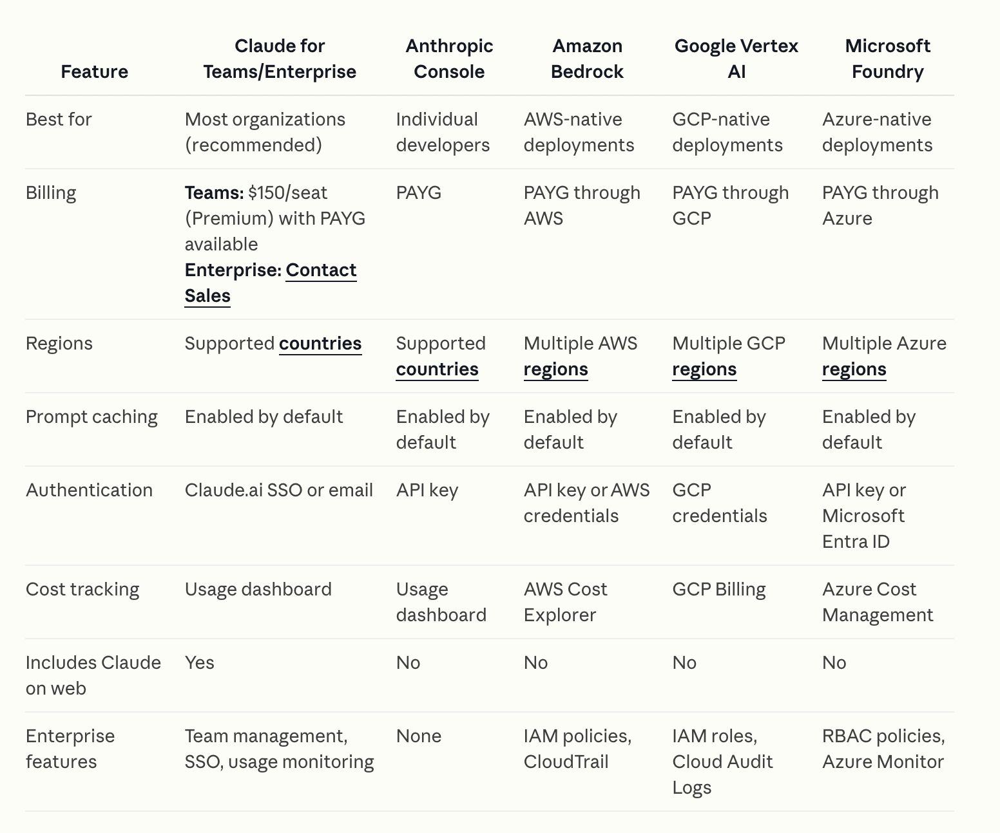

# Claude Code Field Guide

Documenting current best practices when using Claude Code. I've [been using Claude Code regularly since July 2025](https://lawwu.github.io/posts/2025-07-18-starting-to-use-claude-code/). Remember best practices vary quite a bit based on how you use Claude Code, your use case, your experiences and your technical ability. Feel free to use what is useful.

I originally had this sorted in order of importance but decided to map it according to how Claude Code organizes it's [docs](https://code.claude.com/docs/en/how-claude-code-works).


# [Core Concepts - How Claude Code Works](https://code.claude.com/docs/en/how-claude-code-works)

- Understand the components of the [agentic loop](https://code.claude.com/docs/en/how-claude-code-works#the-agentic-loop): models that reason and tools.
    - Understand the [LLMs](https://code.claude.com/docs/en/how-claude-code-works#models) that are available to Claude Code. You can set default models in your `~/.claude/settings.json`. These are the available [models](https://code.claude.com/docs/en/model-config#model-aliases). I generally use `opus`. `opusplan` uses `opus` during plan mode and `sonnet` for execution. Sonnet and Opus have 1 million context window versions with the suffix `[1m]`.
    - Understand the [built-in tools](https://code.claude.com/docs/en/how-claude-code-works#tools) Claude Code has access to. When running Claude Code locally, Claude has tools to do file operations, search, execute commands, web utilities and [code intelligence](https://code.claude.com/docs/en/discover-plugins#code-intelligence) like language servers. I think the most important innovation Claude Code made was giving it the `Bash` tool. This allows Claude to execute any Bash command or use any CLI which gives it access to thousands of tools.
    - **Keep your understanding of the agent harness up to date**: I read the Claude Code [CHANGELOG](https://github.com/anthropics/claude-code/blob/main/CHANGELOG.md) periodically. Also the Claude Code docs are really good: [overview](https://code.claude.com/docs/en/overview), [skills](https://code.claude.com/docs/en/skills), For examlpe Prompt Caching was something I learned about recently: ([Day 15 Tip](https://lawwu.github.io/posts/2026-02-11-claude-code-agentic-coding/#day-15---prompt-caching))
    **Know the difference between the model and the harness**: Improvements can come from the underlying model, the CLI harness, or both. ([Day 10 Tip](https://lawwu.github.io/posts/2026-02-11-claude-code-agentic-coding/#day-10-llm-vs-agentic-harness))

    


## [Environments and interfaces](https://code.claude.com/docs/en/how-claude-code-works#environments-and-interfaces)

### [Execution environments](https://code.claude.com/docs/en/how-claude-code-works#execution-environments)

- Claude Code can run locally on your machine, on the Cloud or via Remote Control (still on your machine but from a browser). Note Claude Code is also available as an [Agent SDK](https://github.com/anthropics/claude-agent-sdk-python) so you can develop applications on top of it.

### [Interfaces](https://code.claude.com/docs/en/how-claude-code-works#interfaces)

You can access Claude Code through:
- [desktop app](https://code.claude.com/docs/en/desktop)
- [IDE extensions](https://code.claude.com/docs/en/ide-integrations)
- web interface at [claude.ai/code](https://claude.ai/code)
- [Remote Control](https://code.claude.com/docs/en/remote-control)
- [Slack](https://code.claude.com/docs/en/slack)
- CI/CD pipelines as a [Github Action](https://code.claude.com/docs/en/github-actions)

You can run Claude Code in your Github Actions. Anthropic has an official action [here](https://github.com/anthropics/claude-code-action). I’ve used this Github Action to mainly review PRs but also generate commits and PRs. I was inspired to set this up when I saw the Anthropic team [close an issue I opened](https://github.com/anthropics/claude-code-action/issues/756) by just tagging “@claude can you fix it” and passing a link. Amazing.



The Claude Code Github Action is another agentic harness. Notably the Github Action is wrapping the Claude Code SDK using the [Agent SDK](https://github.com/anthropics/claude-agent-sdk-python) under the hood with a custom prompt specifically for Github. For example it largely communicates through Github Issues. But it’s amazing just to see the checklist update in realtime and also a link to create a PR from the branch Claude made. It’s pretty easy to setup. You can even use Claude Code to set this up for you in your Github repo. The Claude Code Action team has a couple examples: [claude-review.yml](https://github.com/anthropics/claude-code-action/blob/main/.github/workflows/claude-review.yml) and [issue-triage.yml](https://github.com/anthropics/claude-code-action/blob/main/.github/workflows/issue-triage.yml). I find perusing Anthropic (and OpenAI) repos I learn quite a bit. The system prompt for the Claude Code Action is interesting too. ([Day 13 Tip](https://lawwu.github.io/posts/2026-02-11-claude-code-agentic-coding/#day-13-claude-code-github-actions))

It's important to **choose the right interface**: The terminal UI (TUI) is thinner and more explicit; IDE extensions add convenience but may silently add context. ([Day 11 Tip](https://lawwu.github.io/posts/2026-02-11-claude-code-agentic-coding/#day-11-terminal-vs-vs-code-extension)). I still prefer the TUI. I do think each of the above interfaces is a somewhat distinct agent harness.



## [Work with sessions](https://code.claude.com/docs/en/how-claude-code-works#work-with-sessions)

- Each session is independent
- To resume conversations you can run: `/resume` which will let you pick a previous conversation to pick up from or `claude -c`. 

### [Work across branches](https://code.claude.com/docs/en/how-claude-code-works#work-across-branches)

- You can use git worktrees to parallelize work. I've experimented with this a little but didn't really get the hang of it yet. I like to just have 3-5 terminals. Usually I can manage to work on a few projects at a time. If I need to work on the same project in parallel I'll just `git clone` in 2 places.

### [Resume or fork sessions](https://code.claude.com/docs/en/how-claude-code-works#resume-or-fork-sessions)

### [The context window](https://code.claude.com/docs/en/how-claude-code-works#the-context-window)

- Claude and all LLMs have a context window. It holds your conversation history, file contents, command outputs, memory files like CLAUDE.md, loaded skills and system instructions. Once this fills up, Claude will automatically run a `/compact` command which tries to compress the context and then start a new session
- I like to save persisted docs as markdown that Claude can reference in future sessions
- After Claude Code writes a plan, it typically will clear its context then execute the plan

## [Stay safe with checkpoints and permissions](https://code.claude.com/docs/en/how-claude-code-works#stay-safe-with-checkpoints-and-permissions)

### [Checkpoints](https://code.claude.com/docs/en/how-claude-code-works#undo-changes-with-checkpoints)

I actually didn't know about this feature until I read the docs. Before Claude edits any file, it snapshots the current contents so every edit is reversible! Press `Esc` twice to rewind to a previous state or ask Claude to undo.

### [Control what Claude can do](https://code.claude.com/docs/en/how-claude-code-works#control-what-claude-can-do)

- Press `Shift+Tab` to cycle through Default mode, Auto-accept edits or plan mode
- I typically start Claude Code with `claude --dangerously-skip-permissions`


## [Work effectively with Claude Code](https://code.claude.com/docs/en/how-claude-code-works#work-effectively-with-claude-code)

### [Ask Claude Code for help](https://code.claude.com/docs/en/how-claude-code-works#ask-claude-code-for-help)

- This is kind of meta but Claude Code can teach you how to use it. It's supposed to fetch the latest docs, sometimes it doesn't do that so it's still useful to read the [official docs](https://code.claude.com/docs)
- For example you can have Claude Code debug it's own configuration when a hook had gone wrong
- There are many built in commands that you can see by typing `/`
- Run `/statusline` to have Claude Code style itself to show context usage, cost, and timing where it can influence your next decision. ([Day 8 Tip](https://lawwu.github.io/posts/2026-02-11-claude-code-agentic-coding/#day-8---customize-a-statusline))
- Run `/stats` - Show Claude Code status (version, model, account)
- Run `/stats` - Show Claude Code usage stats
- Run `/insights` to surface recurring mistakes, working patterns, and ideas for improving your setup. I believe this is perf project ([Day 1 Tip](https://lawwu.github.io/posts/2026-02-11-claude-code-agentic-coding/#day-1---insights-command)). I'm a 10% multi-clauder :) 



### [It's a conversation](https://code.claude.com/docs/en/how-claude-code-works#it%E2%80%99s-a-conversation)

Claude is a conversational coding agent. You just ask for things.

#### [Interrupt and steer](https://code.claude.com/docs/en/how-claude-code-works#interrupt-and-steer)

If you see Claude doing something that you dontt expect, you can steer Claude while it is working. It doesn't always stop to do what you ask, in which case you can press `Esc` and send your message again. Note you can push up to see previous messages.

## [Be specific upfront](https://code.claude.com/docs/en/how-claude-code-works#be-specific-upfront)

If you can clearly articulate your desires/intent in clear language, the model will generally perform better. Clear thinking and writing is so much more valuable in this age of AI.

## [Give Claude something to verify against](https://code.claude.com/docs/en/how-claude-code-works#give-claude-something-to-verify-against)

- Claude performs better if it can check it's own work via tests, screenshots of expected UI or any expected output.

## [Explore before implementing](https://code.claude.com/docs/en/how-claude-code-works#explore-before-implementing)

- **Use plan mode for complex work**: Separate codebase exploration from implementation when the task spans multiple files or needs iteration. ([Day 6 Tip](https://lawwu.github.io/posts/2026-02-11-claude-code-agentic-coding/#day-6---use-plan-mode))

## [Delegate, don't dictate](https://code.claude.com/docs/en/how-claude-code-works#delegate-don’t-dictate)

- Think of delegating. to a capable colleague. Give context and direction. Allow Claude to figure out the implementation details (unless you care about the implementation).

# [Extend Claude Code](https://code.claude.com/docs/en/features-overview)

You can extend Claude Code with a CLAUDE.md, Skills, subagents, hooks, MCP and plugins.

The two most important extensions are your CLAUDE.md and Skills.
- Your `CLAUDE.md` adds context to every session.
- **Keep `AGENTS.md`/`CLAUDE.md` up to date**: Anytime Claude Code does something wrong or something you don't expect and it wasn't because of bad instructions, I will add a line to AGENTS.md. When you debug something once, write the fix back into your agent instructions so future sessions inherit it. I used to have Claude edit my `AGENTS.md` but now hand-edit additions. ([Day 3 Tip](https://lawwu.github.io/posts/2026-02-11-claude-code-agentic-coding/#day-3---self-improving-agents.mdclaude.md))
- **Standardize on `AGENTS.md`**: Keep one steering file for all coding agents, and have `CLAUDE.md` point to it. ([Day 2 Tip](https://lawwu.github.io/posts/2026-02-11-claude-code-agentic-coding/#day-2---standardize-on-agents.md))

So you're `CLAUDE.md` will look like:

```md
@AGENTS.md
```

You can run `/memory` to see this being respected as well as the other directories memory is being loaded from:



- See this [memory](https://code.claude.com/docs/en/memory) page for more details on how Claude Code handles memory files. You can place your CLAUDE.md files in a project, globally for a user or globally for a company. You can divide your CLAUDE.md into separate [rules](https://code.claude.com/docs/en/memory#organize-rules-with-claude%2Frules%2F) files. But note these are all loaded at launch with the same priority as CLAUDE.md.


- **Use auto memory deliberately**: Project memory compounds across sessions, but the `MEMORY.md` entrypoint should stay concise and well-organized. ([Day 4 Tip](https://lawwu.github.io/posts/2026-02-11-claude-code-agentic-coding/#day-4---auto-memory))

    ```text
    ~/.claude/projects/<project>/memory/
    ├── MEMORY.md # Concise index, loaded into every session
    ├── debugging.md # Detailed notes on debugging patterns
    ├── api-conventions.md # API design decisions
    └── ...        # Any other topic files Claude creates
    ```




# Skills / Plugins

- Read the [official docs on skills](https://code.claude.com/docs/en/skills)
- "Skills extend what Claude can do. Create a SKILL.md file with instructions, and Claude adds it to its toolkit. Claude uses skills when relevant, or you can invoke one directly with `/skill-name`."
- Be careful of using ANY third-party skill. Generally trust official repos like Anthropic and OpenAI. But there is prompt injection risk from any public skill.
- [`/skill-creator`](https://github.com/anthropics/skills/blob/main/skills/skill-creator/SKILL.md) - a meta-skill from Anthropic that helps you create skills. I love how there is a built-in flow for creating a evaluation pipeline (create eval data, run the skill vs. non-skill workflow, gather feedback and iterate). Note there is Cowork and Claude.ai specific content that can be removed if you do not use those interfaces.
- [`/find-skills`](https://github.com/vercel-labs/skills/blob/main/skills/find-skills/SKILL.md) - skill from Vercel to help you find skills
- Plugins are a way to package up skills and share them
- Some of my favorite plugins and marketplaces are from Anthropic: [Official Anthropic Marketplace](https://github.com/anthropics/claude-plugins-official), [Knowledge Work Plugins](https://github.com/anthropics/knowledge-work-plugins), [skills](https://github.com/anthropics/skills), and [claude-code-plugins](https://github.com/anthropics/claude-code/tree/main/plugins). Some of the ones I've used are:
    - [`/skill-creator`](https://github.com/anthropics/claude-plugins-official/blob/main/plugins/skill-creator/skills/skill-creator/SKILL.md)
    - [`/commit-commands`](https://github.com/anthropics/claude-code/blob/main/plugins/commit-commands/README.md)
    - [plugin-dev plugin](https://github.com/anthropics/claude-code/tree/main/plugins/plugin-dev)
    - [explanatory-output-style plugin](https://github.com/anthropics/claude-plugins-official/tree/main/plugins/explanatory-output-style)
    - [data plugin](https://github.com/anthropics/knowledge-work-plugins/tree/main/data) - I found the meta-skill [`/data-context-extractor`](https://github.com/anthropics/knowledge-work-plugins/blob/main/data/skills/data-context-extractor/SKILL.md) quite inspiring

To install:

```bash
claude plugin marketplace add anthropics/skills
claude plugin marketplace add anthropics/claude-code
claude plugin marketplace add anthropics/knowledge-work-plugins

# Then install a specific plugin
claude plugin install data@knowledge-work-plugins
```

The official Anthropic marketplace is installed already and automatically upated. Other plugins you will have to manually update the marketplace and plugins:

```bash
claude marketplace update marketplace-name
claude plugin update plugin@marketplace-name

claude plugin install plugin@marketplace-name
claude plugin uninstall plugin@marketplace-name
```

You can have Claude Code auto update marketplaces by running `/plugin`, selecting your marketplace and selecting enable auto-update. You can also set this variable to enable plugins to auto-update.

```
export FORCE_AUTOUPDATE_PLUGINS=true
```

- I also found Kieran Klaassen's [compound-engineering-plugin](https://github.com/EveryInc/compound-engineering-plugin) quite inspring. It offers 4 commands for to go through this workflow:

```
Plan → Work → Review → Compound → Repeat
```

| Command | Purpose |
|---------|---------|
| `/ce:plan` | Turn feature ideas into detailed implementation plans |
| `/ce:work` | Execute plans with worktrees and task tracking |
| `/ce:review` | Multi-agent code review before merging |
| `/ce:compound` | Document learnings to make future work easier |

- I prefer to install marketplace and plugins with `claude` instead of `/plugin` and navigating the TUI which is kind of clunky using commands like `claude plugin` and `claude marketplace`.
- [Marketplaces](https://code.claude.com/docs/en/discover-plugins) are a way to host a bunch of plugins, e.g. internally in your company. I recommend your company create an internal skills repo where you can begin hosting plugins/skills that are scoped either for the whole company or a team.
- Skills are an [open standard](https://agentskills.io/home) that most agents now support. Note the YAML frontmatter is different for each. For example Claude Code Skills have `disable-model-invocation` but it's not part of the open standard.
- Vercel has created `skill.sh`, an open marketplace of skills along with a useful CLI `npx skills`.
- Slash commands and skills used to be distinct things but they have since been combined. There is no reason to create commands anymore. You can create a skill that functions like a command with the `disable-model-invocation` field set to true:

```yaml
---
name: deploy
description: Deploy the application to production
disable-model-invocation: true
---

Deploy $ARGUMENTS to production:

1. Run the test suite
2. Build the application
3. Push to the deployment target
4. Verify the deployment succeeded
```

# CLIs I like

- I **prefer CLIs to MCPs**: The Bash tool plus mature CLIs is often more efficient, more debuggable, and lighter on context than loading many MCP servers. ([Day 7 Tip](https://lawwu.github.io/posts/2026-02-11-claude-code-agentic-coding/#day-7---prefer-clis-to-mcps))
- One MCP I still like and have configured is the [DeepWiki MCP](https://docs.devin.ai/work-with-devin/deepwiki-mcp)
- Because CLIs are useful to Claude Code and it's relatively easy to write CLIs now, I have started creating more CLIs when there is some repeated workflow/analysis that I want Claude Code to do. I've liked [Typer](https://typer.tiangolo.com/)


# Other Tips

- **Don't outpace your understanding**: Review plans, read diffs, and make sure you understand the system well enough to validate what the agent changed. ([Day 14 Tip](https://lawwu.github.io/posts/2026-02-11-claude-code-agentic-coding/#day-14-dont-outpace-your-understanding))
- I'm trying to regularly re-think is this the optimal way to do things? How should my code, docs and data be organized to be agent-first? OpenAI's [harness engineering post](https://openai.com/index/harness-engineering/) is very good.
- See these official docs for [common workflows](https://code.claude.com/docs/en/common-workflows) and [best practices](https://code.claude.com/docs/en/best-practices)
- **Save your data**: Claude Code logs are useful operational data, so keep them around by setting `"cleanupPeriodDays": 99999` in `~/.claude/settings.json`. ([Day 5 Tip](https://lawwu.github.io/posts/2026-02-11-claude-code-agentic-coding/#day-5---save-your-data))
- In a corporate setting, an [LLM Gateway](https://code.claude.com/docs/en/llm-gateway) like [LiteLLM](https://github.com/BerriAI/litellm) can be helpful: A gateway provides a unified interfaces to different model provider's APIs, routing, fall-backs, budgets, and integrations with all kinds of third party services like LLM Logging or Guardrails but it also becomes a new point of failure. You can use LiteLLM to swap models with different agentic harnesses, e.g. Claude Code + gpt-5.3-codex or Codex + claude-opus-4-6. ([Day 9 Tip](https://lawwu.github.io/posts/2026-02-11-claude-code-agentic-coding/#day-9---benefits-of-an-llm-gateway))



- **Add session notifications**: I’ve really enjoyed using [Peon Ping](https://github.com/PeonPing/peon-ping) stars for the last few weeks. It adds a Claude Code hook at the beginning and end of each session. It notifies you with a system notification and a custom sound. The default is a Warcraft III peon. There’s also sounds from Starcaft and Age of Empires and a bunch of other goodies. The sounds are fun but it’s genuinly useful knowing when the agent finishes it’s task. It initially was for Claude Code but they’ve recently added support for most coding agents now. ([Day 12 Tip](https://lawwu.github.io/posts/2026-02-11-claude-code-agentic-coding/#day-12-setup-peonping))


# Things I'm currently experimenting with

- [theorist](https://github.com/blader/theorist) skill to keep a `THEORY.md` up to date.


# Things I'd like to try

- `/remote-control`
- [`/adversarial-review`](https://skills.sh/poteto/noodle/adversarial-review)
- `/batch` and `/simplify` - [source](https://x.com/bcherny/status/2027534984534544489)


# Things I've Stopped Doing

- Generating CLAUDE.md/AGENTS.md using `/init`

# Sources of information

- [Claude Code Docs](https://code.claude.com/docs)
- [Boris Cherny on X](https://x.com/bcherny)
- [Simon Willison](https://simonwillison.net/) - I like his [RSS feed](https://simonwillison.net/atom/everything/)
- [Karpathy on X](https://x.com/karpathy)
- [Thariq on X](https://x.com/trq212)
- [Lance Martin on X](https://x.com/RLanceMartin)
- [Latent Space](https://www.latent.space/)
- [Cat Wu on X](https://x.com/_catwu)
